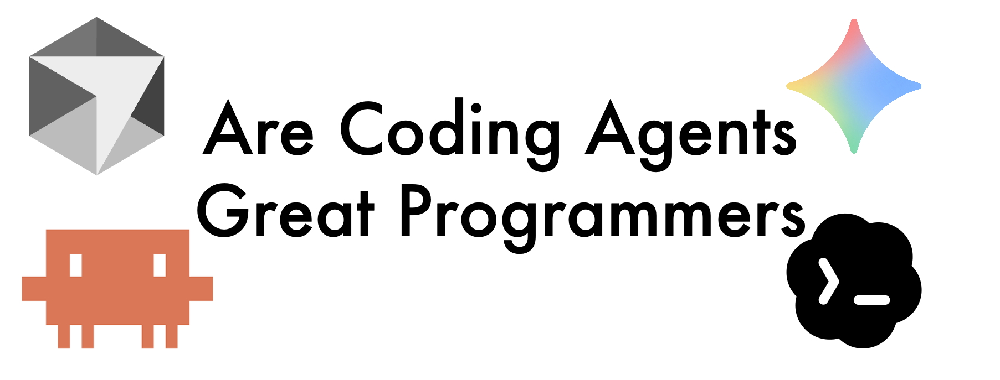

+++
title = "Are Coding Agents Great Programmers?"
date = 2026-04-07
description = "Coding agents are excellent at tactical programming, but designing software is something else entirely."

[extra]
+++

I use coding agents every day.

Over the past few months, tools like Claude Code, especially when paired with well-designed "Skills", have become a core part of how I work. They are fast, surprisingly capable, and in many cases genuinely helpful. They reduce the friction of writing code, handle boilerplate effortlessly, and can even suggest non-trivial implementations that would otherwise take time to think through. I have not counted precisely, but roughly three quarters of the code I commit to GitHub nowadays is directly or indirectly generated by Claude Code. In short, they have changed how I program.

But the more I use them, the more something starts to feel off. It is not about whether they work, but about how they work. They solve problems quickly, yet often in a way that feels local or short-sighted, sometimes even slightly messy beneath the surface. They fix bugs, add features, and generate code that passes tests, yet the overall system does not always feel like it is getting better.

And that led me to a question I could not shake: *are coding agents actually great programmers*?

## Thesis

<u>My answer is no</u>, not yet. And the gap is something fundamental.

Coding agents today are very good at writing code. In many cases, they are better than most humans at quickly producing correct and idiomatic implementations. They can also spot obvious bugs that a careless human, myself included, might miss.

But being a good programmer, especially in the context of real-world software, is not just about writing code. It is about designing systems. It is about choosing the right abstractions, managing dependencies, and shaping a codebase so that it remains understandable, maintainable, and extensible over time.

This is precisely where current AI systems fall short. If I had to summarize it in one sentence, it would be this: <u>software design is fundamentally about managing abstraction and complexity; AI can write code, but it cannot yet design software</u>.

In the rest of this article, I will try to make that claim precise, drawing both from my experience working with coding agents and from first-principles reasoning about how these systems work.

## What Is A "Good Programmer"

Before going further, it is worth clarifying what we mean by a good programmer.

At a basic level, a programmer writes algorithms using data structures and expresses them through abstractions to execute on hardware. But that definition is too broad to be useful here. Anyone who writes code fits it.

In this article, I'm focusing on programmers who <u>build non-trivial, evolving codebases, systems that need to be maintained, extended, and reasoned about over time</u>.

From that perspective, a good programmer is someone who produces good software. And good software, in my mind, has at least three important properties.

- First, it is <u>useful and performant</u>. It solves real problems efficiently and makes good use of the underlying hardware.
- Second, it has <u>strong design quality</u>. It exhibits clean abstractions, a well-thought-out architecture, and minimal unnecessary dependencies.
- Third, it is <u>evolvable</u>. It can be maintained, extended, and adapted as requirements change.

This naturally leads to two levels of programming.

- At the code level, programming is largely <u>tactical</u>. It involves writing correct and efficient implementations, using appropriate idioms, and producing readable code. This is the level of syntax, algorithms, and local logic — and it is exactly where coding agents already excel.
- At the system level, programming becomes <u>strategic</u>. It involves designing abstractions, managing dependencies, and structuring systems so they remain understandable and adaptable over time. This is no longer about solving a single problem, but about shaping a system as it evolves.

In this sense, we can see that programming is fundamentally about managing abstraction and complexity. And it is precisely at the boundary between local correctness and global system design that the difference between coding agents and great programmers begins to emerge.

## Where Coding Agents Excel & The Limitation of Coding Agents

### Where Coding Agents Excel

To make a fair assessment, we should first acknowledge where coding agents are genuinely strong.

At the code level, they are remarkably capable. Drawing from my experience with C++, they can generate correct implementations, apply idioms like RAII and Pimpl, and use common design patterns such as visitor or singleton. They handle non-trivial constructs like variadic templates, concurrency primitives, and API integrations, and can follow practices like test-driven development or DRY when guided.

This is not surprising — they are trained on vast amounts of code and have internalized a wide range of programming patterns. As a result, they are extremely effective at local problem solving: given a bug, they can often fix it; given a well-scoped task, they can implement it quickly and reasonably well.

In that sense, coding agents are excellent pattern executors and task solvers. With the right prompting or tooling, they can even behave like disciplined, pragmatic programmers.

But this strength has a boundary, and that boundary becomes clear when we move from writing code to shaping systems.

### The Limitation of Coding Agents: Tactical Versus Strategic Programming

The limitation of coding agents is mainly that they operate at the wrong level: they are, fundamentally, tactical programmers (Claude Code uses "plan mode" to alleviate this problem, but they still are fundamentally).

<u>Tactical programming</u> focuses on the immediate task. It solves the problem at hand, makes the current feature work, fixes visible bugs, and optimizes for local correctness. It is reactive and short-horizon. The goal is simple: get it working. Much like Facebook's early philosophy: "move fast and break things". And coding agents are very good at this.

<u>Strategic programming</u>, on the other hand, is about shaping the system. It involves choosing the right abstractions, controlling dependencies, maintaining conceptual integrity, and designing for future evolution. It requires stepping back and asking whether a change improves the system as a whole, whether it introduces unnecessary coupling, and whether a local fix should instead trigger a redesign.

This kind of thinking is anticipatory and long-horizon. It requires investment upfront, often through refactoring, with the expectation of long-term payoff. And this is where coding agents struggle.

#### The Gap in Practice

In practice, we can actually feel the gap. Since coding agents are optimized for local problem solving, they tend to favor immediate fixes over structural improvements.

For example, they often patch instead of refactor, even when there is a deeper design issue. At other times, they detect repeated patterns and abstract too early, over-generalizing without sufficient evidence that a true abstraction is needed.

And they extend systems rather than simplifying them, and they accumulate dependencies rather than reducing them. When adding a new feature, an agent might introduce additional conditionals, duplicate existing logic with small variations, or connect components in ways that work but increase coupling. A good engineer, in contrast, would likely rethink the abstraction so the feature fits naturally, eliminate duplication through better design, and reduce dependencies to keep the system clean.

The difference may seem small at the moment, but it compounds dramatically over time.

#### A Deeper Issue

And we can see a deeper issue, where it's not just a tooling problem or a prompting issue: it actually reflects a deeper mismatch.

Coding agents are optimized to produce locally coherent outputs, not globally coherent systems. They do not naturally maintain a persistent mental model of the system, reason about long-term architectural consequences, or develop a sense of taste for good design. As a result, they drift toward tactical programming, even when the situation calls for strategic thinking.

In small scripts or isolated tasks, this limitation is easy to ignore. But in real-world systems, where codebases grow and evolve, the consequences become significant. Tactical decisions accumulate, dependencies grow, abstractions erode, and the system becomes harder to understand and maintain. This is where the gap between writing code and designing software becomes impossible to ignore.

## Why This Happens: A First-Principles View

To understand why coding agents behave this way, it helps to look at the problem from first principles, and we can start from a deeper perspective from computer science itself first.

Two of the most fundamental ideas in CS are: <u>abstraction</u> and <u>complexity decomposition</u>, aka <u>"divide and conquer"</u>.

In practice, this means dividing complex systems into manageable parts and using abstractions to control interactions between them. As Bjarne Stroustrup said in his book *Programming: Principles and Practice Using C++*: "The most fundamental problem in software development is complexity. There is only one basic way of dealing with complexity: divide and conquer". Good software design is the disciplined application of these ideas. It requires global reasoning about how to decompose a system, what abstractions to introduce, and where boundaries should lie.

However, language models operate very differently from this first principle.

- First, they work within <u>a finite context window</u>, which means they only see what is currently provided and cannot reliably maintain long-term structural understanding. Each interaction effectively reconstructs context from scratch, making it difficult to preserve system invariants or architectural intent. The recently leaked Claude Code source code shows its careful management of the context window, where it has different levels of compaction: `snipCompact()`, `microCompact()`, `contextCollapse()`, etc.

- Second, their <u>attention mechanisms</u> introduce a strong locality bias. Modern large language models use the Transformer architecture, which uses the attention mechanism under the hood. Subject to the attention mechanism, nearby code and recent tokens dominate, while distant parts of the system are harder to reason about. Even when the entire codebase fits into context, the model does not treat all parts equally.

- Finally, they are trained on <u>next-token prediction</u>. This objective makes them excellent at producing fluent and locally coherent code, but it does not encourage long-horizon planning. They optimize for what comes next, not for what should exist globally. Yes, Claude Code has "plan mode", but that only alleviates the problem, not completely addressing it.

Back to the core argument, this is why coding agents excel at tactical programming but struggle with strategic programming. They have seen enough examples of good architecture in their training data, but their underlying mechanism does not naturally align with long-horizon planning, abstraction design, and dependency management. These are not just skills, they are modes of reasoning. And until we bridge that gap — either through new architectures or better system-level scaffolding — coding agents will remain powerful tools for writing code, but limited partners in designing software.

## Case Study: Deep Modules

The blog that motivated me to write this article is [Matt Pocock's "5 Agent Skills I Use Every Day"](https://www.aihero.dev/5-agent-skills-i-use-every-day), where he mentioned "deep modules". And that reminded me of a topic I have been thinking about for a while. In October 2025, Professor John Ousterhout visited UCSC and gave a talk titled *"Can great programmers be taught?"*, which also inspired the title of this article. I found it deeply insightful, especially his discussion of abstraction, design, and deep modules.

A <u>deep module</u> exposes a simple interface while hiding complex implementation details. It minimizes what users need to know and reduces cognitive load across the system. The Linux `read()` interface is a classic example: we just provide a file descriptor, a buffer, a size, and that's it. It doesn't care whether the data comes from a file, a keyboard, or a network socket. It doesn't expose unnecessary details like cursor positions or device-specific behavior. The interface is simple, but the implementation underneath can be quite complex.

<u>This idea feels even more important in the age of coding agents</u>. Well-defined, loosely coupled modules with clear interfaces make it much easier for agents to operate effectively. They reduce the need to reconstruct context and allow the agent to work within well-defined boundaries. Good abstractions do not just help humans. They directly improve how coding agents reason about code.

But designing deep modules requires anticipating future use cases, managing dependencies carefully, and making thoughtful trade-offs. These are inherently strategic decisions, and they remain difficult for coding agents.

## Implications: How We Should Work With Coding Agents

If coding agents are strong at local reasoning but weak at global design, then the question becomes *how we should adapt*.

- One approach is to guide them with better structure, aka <u>harness engineering</u>. Practices such as test-driven development, clear specifications, and <u>quick, verifiable iterative feedback loops</u> help ensure that generated code is correct. In effect, we are building scaffolding around the model to enforce discipline.

- Another approach is to design codebases that are more agent-friendly. This means using <u>deep modules</u>, <u>minimizing unnecessary dependencies</u>, and organizing code so that related functionality is naturally grouped. These practices have always been good engineering, but they now also reduce the cognitive burden on AI systems.

- Another particularly powerful technique is to use <u>tracer bullets</u>. Instead of asking the model to generate a complete solution in one shot, we build small, end-to-end slices of functionality, verify them, and then iterate. This avoids large, unvalidated chunks of code and keeps development grounded in reality.

These approaches are not new, they are classic, fundamental ideas that have been formulated for years. I like Matt's framing: "The problem? When new technology emerges, people get excited and forget to go back to the classics. They chase what's shiny instead of what's proven." I totally agree.

To sum up, these approaches align well with how coding agents operate. They are strong at local reasoning, so we give them small scopes. They lack global planning, so we introduce frequent feedback. They tend to over-generate, so we constrain them to incremental progress.

## Conclusion

Taken together, these practices point to a broader shift. Coding agents are not replacing programmers, they are changing what programming looks like. The role of the programmer is <u>moving upward in the abstraction stack</u>: from writing every line of code to designing systems, defining structure, and guiding the overall process.

In that world, the hardest and most valuable skill remains unchanged: <u>having good taste and judgment</u>. Knowing what makes a good abstraction, how to manage complexity, and how to shape a system over time is still the core of programming.
