+++
title = "Cerebras Systems and the Wafer-Scale Engine: Scaling AI by Making the Chip Bigger"
date = 2026-05-16
description = "How Cerebras scales up by making the chip the size of a wafer, and why this matters for LLM inference."

[extra]
+++

  

## Scaling-Up: More Than Moore

For several decades, computing improved in a way that felt almost automatic. Moore's Law gave us more transistors every generation, and Dennard scaling made those transistors faster, more energy efficient, and cheaper as they shrank. Software developers could often wait for the next process node and get a free performance upgrade.

However, that "free lunch" is gone — although transistors are still improving, the old rhythm is weaker. Process nodes are more expensive, power density is harder to manage, and moving data has become a first-class bottleneck. At the same time, machine learning (ML) workloads have grown at an exponential pace. And frontier AI systems are not just asking for more floating-point operations (FLOPs); they are asking for more memory capacity, more memory bandwidth, lower communication latency, and easier ways to scale across many devices.

To address this pressure, there are roughly two broad responses. One is scale-out: connect many accelerators together. This is the path behind modern GPU clusters. A single GPU is powerful, but a training run or inference service may require racks of GPUs connected through NVLink, etc.

The other response is *scale-up*: make one device much larger — instead of pursuing "more Moore's Law", it aims for something "more than Moore's Law". *Cerebras Systems* is the most visible company pursuing this approach (Figure 1). Its central idea is almost naive-sounding: if one chip is too small, why not make the chip the size of the wafer?

**Figure 1.** The Cerebras Wafer-Scale Engine next to a knife and fork, giving a sense of its physical scale compared with everyday objects.

You might then ask: the latter sounds natural, so why has nobody done it before? Well, people have tried — there have been historical attempts, such as Trilogy Systems and Texas Instruments, but they all failed. Let me explain what a wafer is and why making a wafer-scale chip is hard in the next section.

## What Is Wafer-Scale Integration?

Let's take making *spaghetti* as an example. Imagine we are making and serving spaghetti in a restaurant. We don't make one tiny piece of dough per spaghetto — we make one big piece of dough per dish, and then we break that big dough into multiple strands of spaghetto. And this is also the case in semiconductors — we don't make those small chips one by one; we make a big plane, called a wafer, and then cut the wafer into hundreds of small pieces, where each piece is a die, or chip, used as a CPU/GPU.

So back to the question: "why not just make a wafer-scale chip in the first place?" It's because doing so is hard. When you extrude the dough, it might break off; when you cook it in the pan, it might also break off; and even if you do end up with a single strand of spaghetti, it's not "perfect" throughout the entire strand — some sections are perfectly round and smooth, while others are not, and some have "defects". The same applies to chips: dies on a wafer can have defects, and once they do, the wafer cannot operate. The best chef can't guarantee a uniformly perfect strand of spaghetti, and even the best TSMC process can't always produce a wafer without any defects.

After understanding it at a high level, let's make it a little bit more technical. So a silicon wafer is a circular slice of semiconductor material, usually 300 mm in diameter in leading-edge manufacturing. During fabrication, a lithography machine exposes circuit patterns onto the wafer. But there is a limit to how large one exposure field can be, which is called the *reticle limit*.

Normally, many individual dies are patterned on a wafer. The empty lanes between them are called scribe lines, and after fabrication a saw cuts through those lanes to separate the dies. A packaged GPU, CPU, or AI accelerator begins life as one of those rectangles (Figure 2).

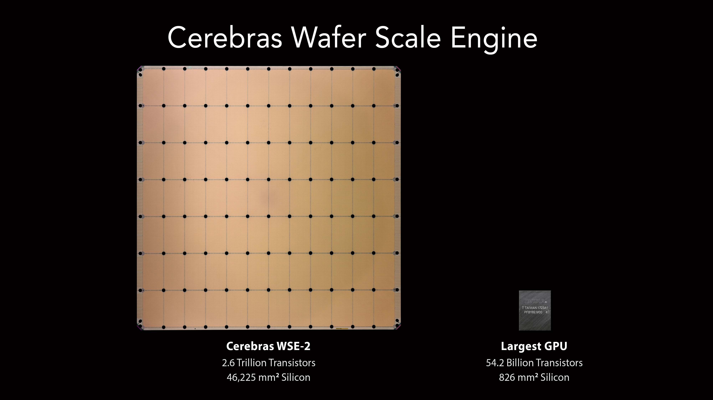

**Figure 2.** Size comparison between a Cerebras WSE and a conventional GPU die. The WSE occupies the area of an entire wafer, dwarfing the largest reticle-limited GPU.

Wafer-scale integration breaks this convention. Instead of treating scribe lines as future cut lines, Cerebras uses them as part of the interconnect. In effect, the wafer is patterned as a grid of reticle-sized regions, but those regions are wired together so the final product behaves as one processor. The WSE is therefore larger than what a single reticle exposure could normally define.

As we already discussed, the obvious problem is defects. Semiconductor manufacturing is astonishingly precise, but not perfect. A particle, patterning error, or process variation can break some part of a circuit. If a conventional chip is small enough, many dies on the wafer will still be good. If one die is defective, the manufacturer discards or bins that die and sells the rest. But if the entire wafer is one chip, a naive design would have a terrible yield: one defect anywhere might ruin the whole product.

Cerebras' answer is architectural regularity, and the WSE also includes redundant cores and redundant fabric links. The WSE is built from a very large number of small, repeated processing elements. If one small region is defective, the system can route around it or substitute redundant resources. This is like designing a city with many small blocks and extra roads. A closed intersection is inconvenient, but it does not make the whole city unusable because traffic can be redirected. Therefore, defective cores can be disabled, and the logical two-dimensional mesh can be restored through reconfiguration (Figure 3).

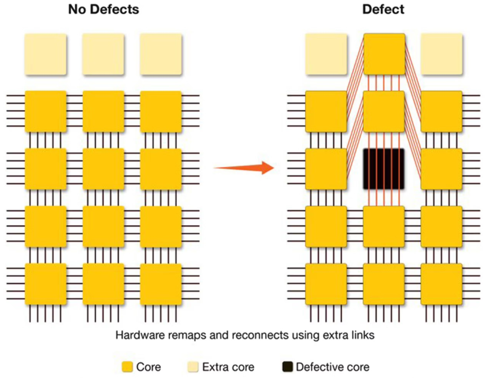

**Figure 3.** The WSE's regular two-dimensional mesh of cores connected by short fabric links. Redundant cores and rerouting around defective cores let the logical mesh be restored even when individual cores fail.

Another thing is that the physical system itself is difficult. A wafer-scale chip consumes tens of kilowatts. Power cannot be delivered only from the edges in the same way as for a small die, because the voltage drop across such a large area would be severe. Heat cannot be removed with ordinary air cooling. And the silicon wafer, package materials, printed circuit board, and cold plate all expand differently as temperature changes. So the Cerebras product is a packaging, power-delivery, cooling, and system-integration story. The CS systems that house the WSE use custom liquid cooling and a specialized mechanical assembly often described as an engine block. This is the price of making the wafer the unit of computation. GPUs pay complexity in multi-chip packaging, HBM integration, and cluster networking; Cerebras pays complexity in wafer-scale packaging, cooling, power delivery, defect tolerance, and software mapping.

## Anatomy of the Wafer-Scale Engine

The WSE is best understood as a spatial machine: a large two-dimensional grid of simple processing elements (PEs) connected by an on-chip fabric (Figure 5). Each core/PE has three components: local compute, local memory, and a router (Figure 4). There is no large shared cache hierarchy in the traditional CPU/GPU sense. Instead, data movement between cores is explicit and routed over the fabric. Figure 6 and Figure 7 together show the wafer-to-core hierarchy and a zoomed-in view of a local region.

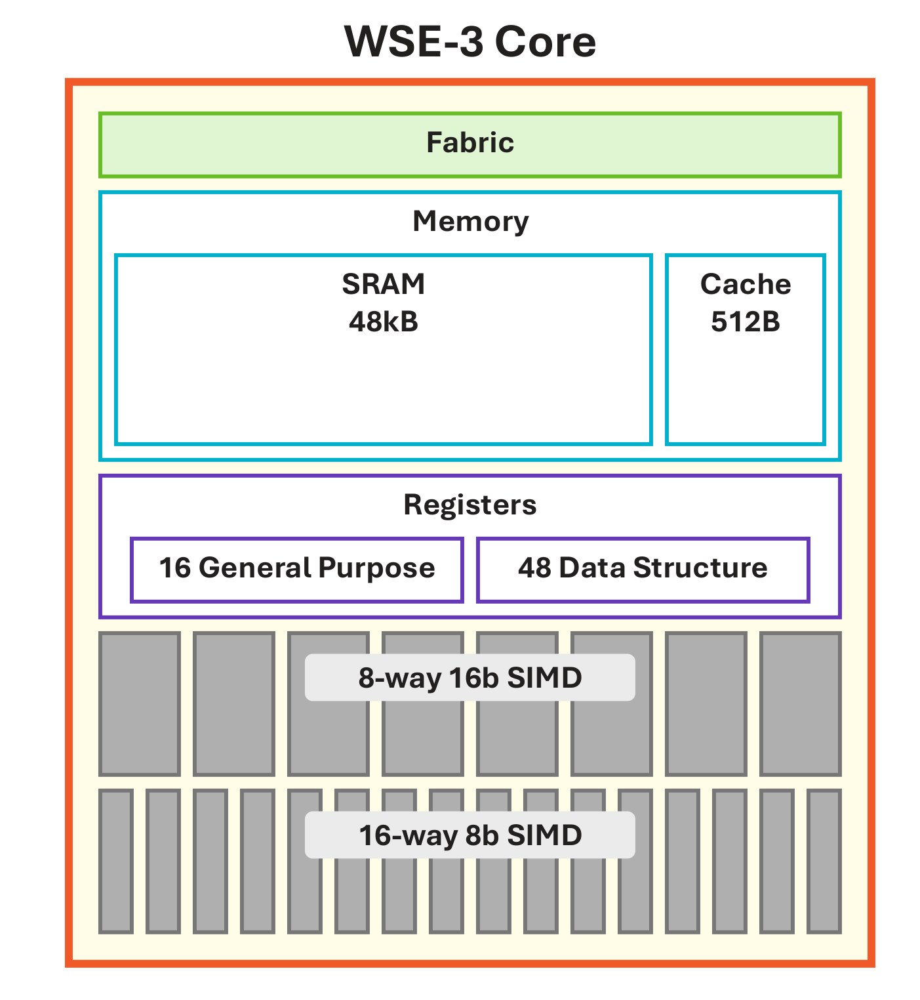

**Figure 4.** Zoom-in of one core: local compute (general-purpose and tensor datapath with GPRs and DSRs), local SRAM, and a router connecting to its four neighbors.

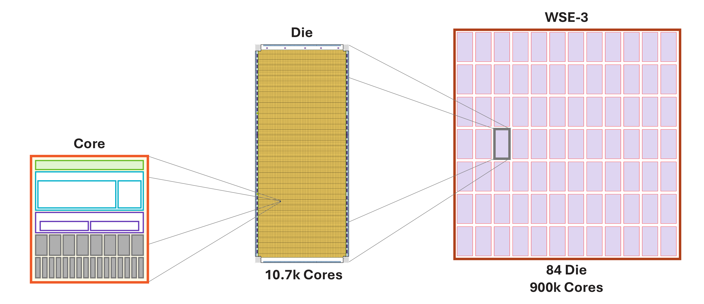

**Figure 5.** From wafer to die to core: a wafer-sized chip composed of a grid of identical processing elements connected by an on-chip fabric.

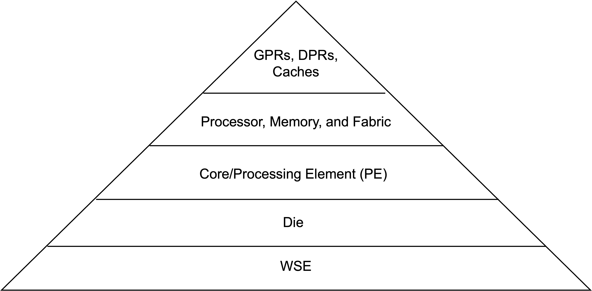

**Figure 6.** Hierarchy of the WSE: wafer → die → core, with local SRAM and router at each core.

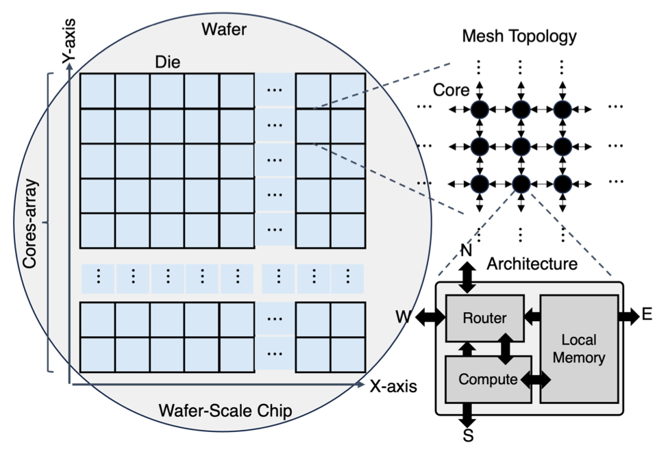

**Figure 7.** Zoomed-in view of a local region of the wafer, showing the tight coupling between compute, SRAM, and fabric routers across neighboring cores. This re-iterates Figure 5 by making the local compute–memory–router arrangement of each core concrete.

The current WSE-3, announced in 2024, is built on TSMC's 5 nm process and is specified with 900,000 cores, 4 trillion transistors, 44 GB of on-chip SRAM, 21 PB/s of memory bandwidth, and 214 Pb/s of fabric bandwidth.

Each WSE core is intentionally small and local-memory oriented (see Figure 4). Half of the silicon area is devoted to SRAM placed close to the compute datapath. That SRAM is the working memory for the local computation, organized to feed the core's tensor computation units at high bandwidth (see Figure 8).

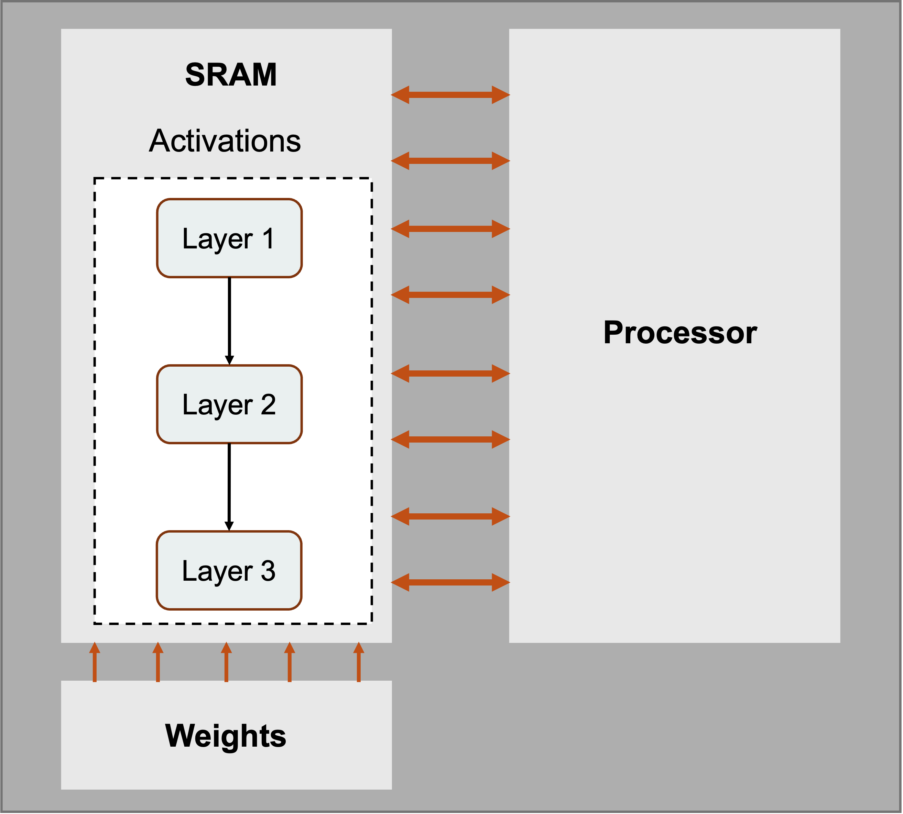

**Figure 8.** Layers mapped onto WSE cores: activations sit in local SRAM placed physically right next to compute, while weights stream in over the fabric.

This local-memory design matters because modern accelerators often have far more compute bandwidth than external memory bandwidth. A GPU can perform huge numbers of FLOPs per second, but operands must come from registers, cache/SRAM, HBM, DRAM, or another GPU. If a workload has enough reuse, the GPU can amortize memory traffic over many operations. Dense matrix-matrix multiplication is a good example: each loaded value can be reused many times. But not every useful operation has that much reuse. Sparse operations, vector operations, and batch-size-one inference can expose memory bandwidth limits.

The WSE tries to make lower-reuse operations less painful by providing enormous aggregate SRAM bandwidth. If memory sits next to compute across the wafer, the wires are short and the bandwidth adds up across many cores. The tradeoff is capacity: SRAM is fast but area-expensive, while DRAM and HBM provide much more capacity per square millimeter. Cerebras compensates by devoting roughly half of the wafer's area to SRAM.

The local processor is programmable. Just like traditional CPUs, it supports general-purpose instructions. It has 16 general-purpose registers (GPRs), so it can handle regular operations like arithmetic, branches, loads, and stores. Unlike traditional CPUs, it is also designed around tensor operations — it has 48 data-structure registers (DSRs) that serve as operands for instructions. We need these dedicated tensor-operand registers because the WSE is dealing with tensors, and it needs the metadata (pointer to the address, shape, size) for each tensor (see Figure 4).

The router is the third essential component (see Figure 4). The WSE becomes interesting because hundreds of thousands of cores can communicate over a deterministic on-chip network. The fabric carries both data and control information, and routing can be statically configured for a workload. Cerebras often describes communication using "colors," which are virtual channels or routes used by the fabric. This lets software map neural-network layers onto physical regions of the wafer and set up predictable data movement between them.

We can think of the architecture and working style of GPUs and WSEs as a factory floor. A GPU is often like a set of extremely powerful workstations fed by a centralized warehouse and fast forklifts. The WSE is more like a huge workshop where every station has a small local parts bin, a simple tool, and conveyor belts to its neighbors. If the work can be laid out spatially, the workshop can avoid many long trips to the warehouse.

## Dataflow Execution and the Wafer MatMul Array

As we all know, neural-network layers are dominated by matrix operations. Transformers, for example, repeatedly multiply activation vectors by weight matrices in attention and feed-forward blocks. Cerebras maps these operations onto the wafer as a large matrix-multiply array.

The important idea is that execution is dataflow-driven. In a conventional sequential processor like a CPU, the program counter largely determines what instruction runs next. In a dataflow machine, the arrival of data itself can trigger computation. On the WSE, when a packet arrives over the fabric, hardware can use that packet's control information to select and launch the appropriate operation.

Now let's illustrate, using transformer-style tensors, how activation and weight tensors operate on the wafer; the overall picture is shown in Figure 9.

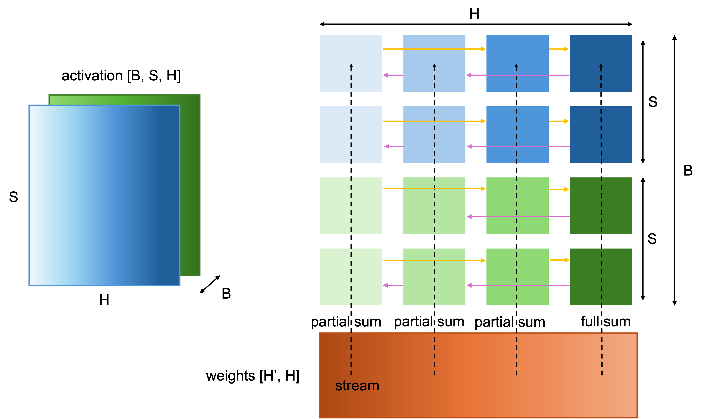

**Figure 9.** Mapping a matrix multiplication onto the WSE. Activations are partitioned across the wafer (hidden dimension along x; batch and sequence along y) and held in SRAM, while weights are streamed in and broadcast across columns. Partial sums are reduced through the on-chip fabric.

Firstly, the Cerebras CS system (the server system that houses the WSE) stores weights in external memory and streams them onto the wafer for the forward and backward passes.

Secondly, the activations are stored in the cores' SRAMs and are used to compute with the weights streamed into the cores. In the canonical form, Cerebras describes three logical dimensions: batch (the number of batches), sequence (the number of tokens), and hidden (feature size) dimension. The hidden dimension is split across the wafer's x-direction. Batch and sequence positions are split across the y-direction. In other words, each core or group of cores owns a slice of the activation tensor.

Now consider a matrix multiplication. The weights are streamed onto the wafer and broadcast across columns. Within a row of the weight matrix, multiple weights map to a column of cores. When a weight value arrives, it triggers fused multiply-accumulate operations using the activations already stored in local SRAM. The core multiplies the incoming weight by its local activation elements and accumulates into a local accumulator.

This is where the architecture's details matter. The weight does not have to be stored permanently in the core's SRAM. It can stream through, trigger the computation, and move on. If the weight matrix is sparse, only nonzero weights need to be broadcast, so zero weights do not trigger useless compute.

After a row of weights has been processed, each core holds only a partial sum. This is unavoidable because the hidden dimension was split across the x-direction. To form the final output activation, those partial sums must be reduced across the row of cores. The partial-sum reduction is triggered by command packets sent to the relevant columns. Most columns receive a partial-sum command, while one receives a final-sum command. Once the command arrives, dataflow scheduling triggers a reduction operation that uses fabric tensor operands rather than ordinary local-memory tensor operands. The cores communicate in a ring pattern across the wafer, using statically configured fabric routes. Partial sums are accumulated as they move through the ring. The final-sum command tells the designated core to store the completed output value in the same logical distribution used for the input activations, so the next layer can begin with the data already laid out correctly.

This is a compact idea but a powerful one. Computation, communication, and reduction are scheduled together. Microthreads allow the reduction for one weight row to overlap with FMAC computation for the next row. That overlap is important because otherwise communication would erase much of the benefit of parallel compute.

The WSE's MatMul array therefore has three useful properties:

- **Spatial locality:** activations live in local SRAM near the cores that use them.
- **Streamed weights:** weights can be broadcast through the fabric and need not consume long-term local storage.
- **Fabric reduction:** partial sums are reduced through the on-chip network using dataflow-triggered tensor instructions.

## Comparison With GPU Accelerators

In Table 10, we compare WSE-3 with NVIDIA Blackwell B300, with Google's TPU (Ironwood) also included for reference.

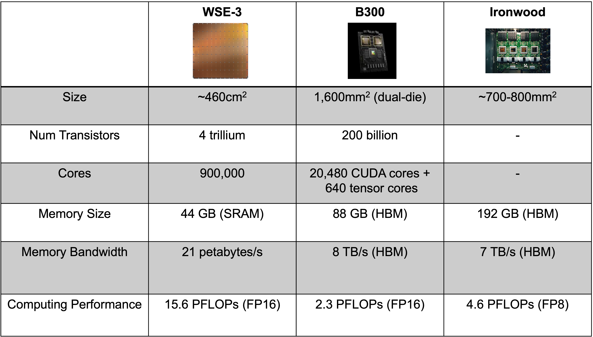

**Table 10.** Side-by-side comparison of Cerebras WSE-3, NVIDIA Blackwell B300, and Google TPU Ironwood across key specifications.

The strongest Cerebras argument is memory bandwidth. WSE-3 is specified at 21 PB/s of on-chip memory bandwidth. This number is enormous because it aggregates SRAM bandwidth across the wafer. A Blackwell-class GPU has HBM bandwidth measured in TB/s, not PB/s. But note some caveats as well: (1) not every workload can use all aggregate bandwidth equally, and (2) HBM provides far more capacity than SRAM.

The strongest GPU argument is ecosystem and flexibility. The entire ecosystem is NVIDIA's moat: CUDA, libraries, profilers, kernels, deployment experience, etc.

## Why Cerebras Is Fast for LLM Inference

To understand why Cerebras WSE is blazingly fast (see Figure 11), we need to understand the nature of the most popular current LLM models (transformers).

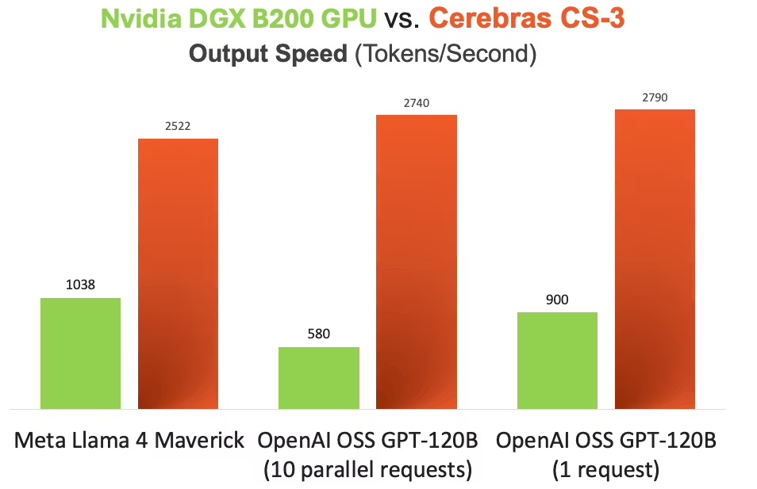

**Figure 11.** Token-generation throughput of the Cerebras WSE versus an NVIDIA B200 GPU for LLM inference. The WSE's aggregate on-chip SRAM bandwidth translates into a large gap in tokens per second.

Without diving too deeply into the architecture, all we need to know is that it is an autoregressive model. Autoregressive model inference has a simple but brutal structure. To generate one token, the model performs a forward pass. To generate the next token, it performs another forward pass, now including the previous output. Generating 1,000 tokens means a long serial chain of model executions. Some parts of the computation can be parallelized, especially prompt processing, but output generation has an inherently sequential component.

This is why memory bandwidth matters so much. Each generated token requires reading a large amount of model state and parameters. If the model's weights and cache traffic cannot reach compute quickly, arithmetic units wait.

The WSE inference strategy maps model layers onto regions of the wafer (see Figure 12). A fraction of the wafer can hold and execute a layer; adjacent regions can hold subsequent layers.

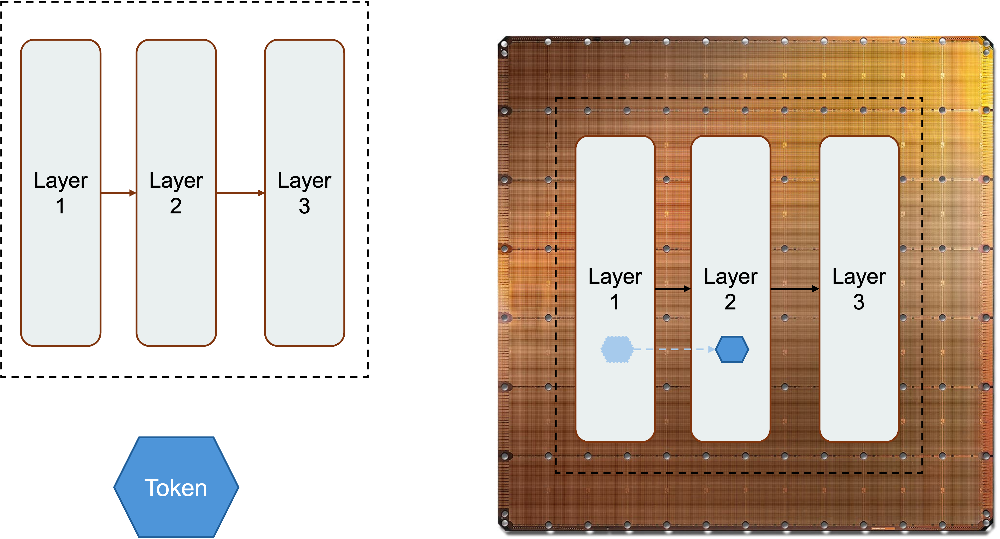

**Figure 12.** Spatial pipelining of LLM inference on the WSE: model layers are placed on adjacent regions of the wafer, and tokens flow through this on-chip pipeline rather than crossing HBM or multi-GPU fabrics.

Tokens flow through this spatial pipeline. Because the communication between regions is on-chip, the pipeline stages can be placed physically close to one another to reduce latency. When a model fits within one or a small number of wafers, much of the repeated memory traffic stays in local SRAM rather than crossing HBM interfaces and multi-GPU fabrics.

That distinction really makes Cerebras' value proposition more important with agentic applications, where model reasoning, tool calling, results checking, and model answering are highly coupled and interleaved (see Figure 13). If each step waits on slow token generation, the whole workflow feels sluggish. Faster inference can enable more model calls within the same wall-clock budget.

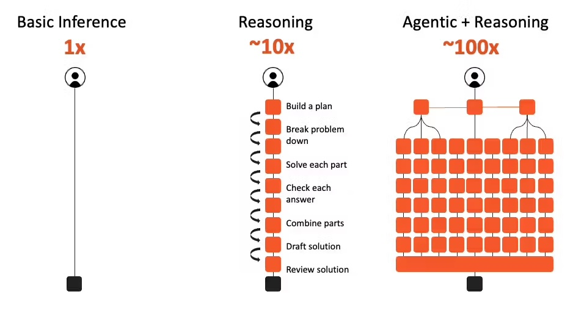

**Figure 13.** Reasoning and agentic workflows interleave many model calls. End-to-end latency is dominated by cumulative token-generation time, making per-step inference speed especially valuable.

From the QoR perspective, being faster at inference also means better QoR, because models can think more and do more reasoning (chain-of-thought (CoT), tree-of-thought (ToT), etc., under the hood) in a given amount of time, and more reasoning generally means better results.

From the user's perspective, responsiveness also changes behavior. If a model streams quickly, users interrupt less, iterate more, and stay in the task in a "flow state", and thus become more productive. This is the same reason web performance matters. A slightly better page that takes too long to load may lose to a good-enough page that appears instantly. In AI products, latency is not just a backend metric; it shapes the product.

## Limitations and Outlook

Cerebras' wafer-scale approach is impressive because it solves problems that once made wafer-scale integration look impractical. But it is not magic, and its limits are just as important as its strengths.

First, SRAM capacity is limited. WSE-3's 44 GB of on-chip SRAM is enormous for SRAM, but not enormous compared with the HBM capacity available across modern GPU systems. Large models, long context windows, and many concurrent users can consume memory quickly. Cerebras can use multiple wafers and external systems, but once data leaves the wafer, the architecture loses some of its most elegant locality advantage.

Second, off-wafer I/O matters. A wafer has extraordinary internal bandwidth, but system-level performance depends on what must cross the wafer boundary. If a workload requires frequent communication with other wafers, CPUs, storage, or external memory, the bottleneck can move outside the beautiful on-chip fabric. This is one reason workload fit is crucial.

Third, the system is physically specialized. Power delivery and cooling are not afterthoughts. A wafer-scale engine consuming tens of kilowatts requires custom liquid cooling and careful mechanical design. That affects data-center deployment, serviceability, supply chain, and cost.

Fourth, software maturity matters. GPUs have a massive ecosystem. Cerebras can hide some complexity behind frameworks and compiler tooling, but specialized hardware always needs specialized software work to reach high utilization. The best hardware idea in the world still needs kernels, compilers, debuggers, operators, and users.

Finally, ML models or algorithms might shift. Right now, autoregressive models are the most popular, but once a new class of algorithms like diffusion comes to dominate, the Cerebras WSE could lose a lot of its value.

The likely future is not one architecture replacing all others. GPUs will remain central because they are flexible, available, and deeply supported. TPUs, Trainium, custom ASICs, and other accelerators will continue to compete for large-scale training and inference. Cerebras occupies a distinctive point in this landscape: a scale-up SRAM-rich machine designed to make some AI workloads feel like they run on one giant chip rather than a distributed cluster.

## References

1. [Cerebras Wafer-Scale Hardware Crushes...](https://newsletter.semianalysis.com/p/cerebras-wafer-scale-hardware-crushes), SemiAnalysis.
2. [Cerebras: Faster Tokens, Please](https://newsletter.semianalysis.com/p/cerebras-faster-tokens-please), SemiAnalysis.
3. [Cerebras CS-3 vs. NVIDIA DGX B200 Blackwell](https://www.cerebras.ai/blog/cerebras-cs-3-vs-nvidia-dgx-b200-blackwell), Cerebras Blog.
4. S. Lie, "Cerebras Architecture Deep Dive: First Look Inside the Hardware/Software Co-Design for Deep Learning," *IEEE Micro*, vol. 43, no. 3, pp. 18–30, May–June 2023. doi: [10.1109/MM.2023.3256384](https://doi.org/10.1109/MM.2023.3256384).
5. S. Lie, "Wafer-Scale AI: GPU Impossible Performance," *2024 IEEE Hot Chips 36 Symposium (HCS)*, Stanford, CA, USA, 2024, pp. 1–71. doi: [10.1109/HCS61935.2024.10664673](https://doi.org/10.1109/HCS61935.2024.10664673).
6. M. Ozkan, L. Pompa, M. S. B. Iqbal, Y. Chan, D. Morales, Z. Chen, H. Wang, L. Gao, and S. Hernandez Gonzalez, "Performance, efficiency, and cost analysis of wafer-scale AI accelerators vs. single-chip GPUs," *Device*, vol. 3, issue 10, 2025, 100834. doi: [10.1016/j.device.2025.100834](https://doi.org/10.1016/j.device.2025.100834).
7. Y. Kundu, M. Kaur, T. Wig, K. Kumar, P. Kumari, V. Puri, and M. Arora, "A comparison of the Cerebras wafer-scale integration technology with NVIDIA GPU-based systems for artificial intelligence," *arXiv preprint* [arXiv:2503.11698](https://arxiv.org/abs/2503.11698), 2025.
